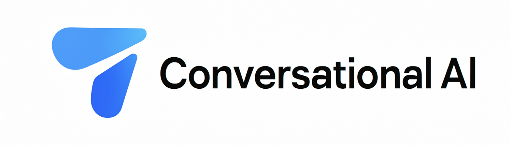
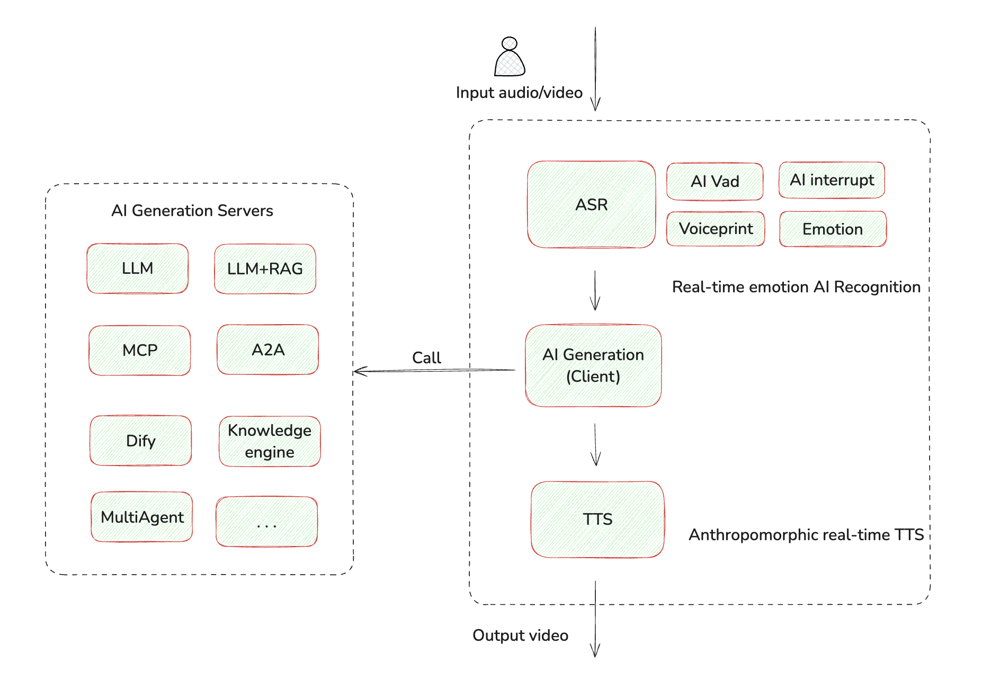

# 🚀 Conversationsal AI Agent

<div align="center">

[](https://cloud.tencent.com/product/trtc)
[](https://cloud.tencent.com/document/product/647/110584)
[](https://nodejs.org/)
[](LICENSE)
[](CONTRIBUTING.md)

</div>

<div align="center">
  
</div>

## ✨ 产品简介

Conversationsal AI Agent 是一个快速 AI 应用构建平台，让您轻松打造智能语音交互应用。通过简单的配置，即可实现多种 AI 对话场景，如智能客服、语音助手、情感陪聊等。

[Deepwiki for Conversationsal AI Agent](https://deepwiki.com/chicogong/conversationsal-ai-agent)

## 🌟 核心特性

- 🎯 **快速集成**：基于 TRTC SDK，快速实现音视频通话功能
- 🤖 **AI能力丰富**：集成多种 AI 能力，满足不同场景需求
- ⚙️ **灵活配置**：支持自定义 Agent 配置，轻松扩展新功能
- 🛡️ **稳定可靠**：依托 TRTC 强大的音视频能力，确保通话质量
- 🎨 **简单易用**：提供简洁的 API 接口，降低开发门槛
- 🌐 **多Agent支持**：支持多种Agent类型，满足不同场景需求

## 💯 核心亮点

### 体验优化
- ✅ **自然交互**：支持语义断句、自然停顿和思考时间
- ✅ **环境适应**：声纹识别技术支持嘈杂环境下的对话，有效过滤背景人声
- ✅ **真实感提升**：支持环境音模拟，增强对话真实感

### 技术优化
- ⚡ **响应速度**：采用分句策略实现首句快速返回，欢迎语预请求降低耗时
- 🔊 **语音质量**：服务端噪声过滤，ASR降噪参数优化
- 🤝 **交互体验**：智能附和语增加拟人化交互，VAD打断优化，单字过滤减少误打断

### 高级功能
- 📊 **服务端回调**：支持延迟统计、内容审核、通话记录存储
- 📱 **客户端回调**：实时字幕展示、状态展示、异常处理、通话统计

## 🔄 系统架构

下图展示了Conversational AI Agent的核心处理流程，包括语音输入处理、AI生成和输出环节：

<div align="center">
  
</div>

### 主要组件
- **语音输入处理**：包含ASR语音识别、AI VAD、声纹识别和情感识别等模块
- **AI生成服务**：支持LLM、LLM+RAG、MCP、A2A、Dify、知识引擎等多种生成方式
- **语音输出处理**：采用拟人化实时TTS技术，提供高质量的语音合成

整个系统通过流式处理实现低延迟、高质量的实时对话体验。

## 🎮 Agent Card 展示

我们的平台支持多种 Agent 类型，每种 Agent 都有其独特的应用场景：

<div align="center">

| Agent 类型 | 核心功能 | 适用场景 | 实现状态 |
|------------|---------|---------|---------|
| 外呼客服 Agent | 自动外呼、智能话术、质量监控 | 营销、客服回访 | ✅ 已实现 |
| 甜妹陪聊 Agent | 自然交互、情感超拟人对话、个性化陪伴 | 社交、娱乐 | ✅ 已实现 |
| 声纹锁定 Agent | 声纹锁定、过滤周边人声、保证高质量通话 | 办公室，街道等嘈杂场景 | ✅ 已实现 |
| MCP Agent | 接入[MCP](https://github.com/modelcontextprotocol)扩展工具调用等功能 | 更便捷的工具调用 | ✅ 已实现 |
| A2A Agent | 接入[A2A](https://github.com/google/A2A)协议 | 多Agent对话 | 🔄 开发中 |
| Coze Agent | 接入 [Coze](https://www.coze.com) 平台能力 | 快速构建智能对话应用 | 🔄 开发中 |
| Dify Agent | 接入 [Dify](https://dify.ai) 平台能力 | 企业级 AI 应用开发 | 🔄 开发中 |
| 知识引擎 Agent | 接入[腾讯云知识引擎](https://cloud.tencent.com/product/lke) 企业级知识库解决方案 | 智能问答、知识库查询 | 🔄 开发中 |

</div>
如果需要某个Agent可以留言，我们会尽快为您提供。
当然，您也可以根据您的需求，创建自己的Agent。
也可以将您的AgentCard贡献到这个项目中，让更多的人使用您的Agent。

## 🚀 快速开始

### 1. 安装依赖

```bash
npm install
```

### 2. 配置环境变量

复制 `env.example` 文件为 `.env`，并填入您的实际配置值：

```bash
cp env.example .env
# 然后编辑 .env 文件，填入您的配置信息
```

主要环境变量包括：
- 腾讯云API凭证（TENCENT_SECRET_ID, TENCENT_SECRET_KEY）：从[腾讯云 API 密钥](https://console.cloud.tencent.com/cam/capi)获取
- TRTC配置（TRTC_SDK_APP_ID, TRTC_SECRET_KEY）：从[TRTC 控制台](https://console.cloud.tencent.com/trtc/app)获取
- LLM配置（LLM_API_KEY, LLM_API_URL, LLM_MODEL）：从您的 LLM 服务提供商获取
- TTS配置：
  - 腾讯云 TTS: AppId从[TTS 控制台](https://console.cloud.tencent.com/tts)获取，SecretId和SecretKey从[腾讯云 API 密钥](https://console.cloud.tencent.com/cam/capi)获取
  - Minimax TTS: GroupId, APIKey, VoiceType从 Minimax 控制台获取

### 3. 使用配置向导创建Agent(可选)

运行以下命令来创建您的自定义AI助手：

```bash
npm run create
```

按照提示输入您的配置信息，向导将自动创建Agent配置文件。

### 4. 启动应用

```bash
npm start
```


## 🛠️ 自定义Agent配置

### 配置向导

设置向导将要求您提供以下信息：

- **基本信息**：助手ID、名称、描述、能力列表、语音类型、个性
- **行为配置**：欢迎消息、打断模式
- **语音识别配置**：语言模型、热词列表
- **大语言模型配置**：LLM类型、历史长度、系统提示词
- **文本转语音配置**：TTS提供商、语音模型、语速

## 📦 项目结构

```
conversational-ai-agent/
│
├── public/                    # 静态资源
│   ├── index.html             # 主页面
│   └── assets/                # 图片等静态资源
│
├── src/                       # 源代码目录
│   ├── js/                    # JavaScript 文件
│   │   ├── api.js             # API 调用相关
│   │   ├── app.js             # 应用主逻辑
│   │   ├── trtc-client.js     # TRTC客户端
│   │   ├── metrics.js         # 指标相关
│   │   ├── constants.js       # 常量定义
│   │   ├── agent-card.js      # 代理卡片
│   │   └── ui.js              # UI 相关
│   │
│   ├── styles/                # CSS 样式文件
│   │   └── styles.css         # 主样式文件
│   │
│   └── agent_cards/           # 代理卡片配置
│       ├── assets/            # 代理卡片资源
│       ├── scripts/           # 配置工具脚本
│       │   └── create_agent.js # AI-Agent创建工具
│       ├── sweet_girl.js      # 代理配置
│       ├── mcp_tencent_map.js # 代理配置
│       ├── default.js         # 默认代理
│       └── index.js           # 导出配置
│
├── docs/                      # 文档
│
├── server.js                  # 服务器入口文件
├── env.example                # 环境变量示例
├── package.json               # 项目配置
└── README.md                  # 项目说明
```

## 🤝 贡献指南

我们欢迎任何形式的贡献！请查看我们的 [贡献指南](CONTRIBUTING.md) 了解更多信息。

## 📄 许可证

本项目采用 [MIT 许可证](LICENSE)。

## 📞 联系我们

- 邮箱：chicogong@tencent.com
- TRTC-AI文档：[产品文档](https://cloud.tencent.com/document/product/647/110584)
- 问题反馈：[GitHub Issues](https://github.com/yourusername/trtc-ai-build-quickly/issues)
- 提交工单：[提交工单](https://cloud.tencent.com/online-service?from=doc_647)

## 🙏 

感谢您使用Conversationsal AI Agent !!

<div align="center">
  <sub>Built with ❤️ by chico</sub>
</div>

